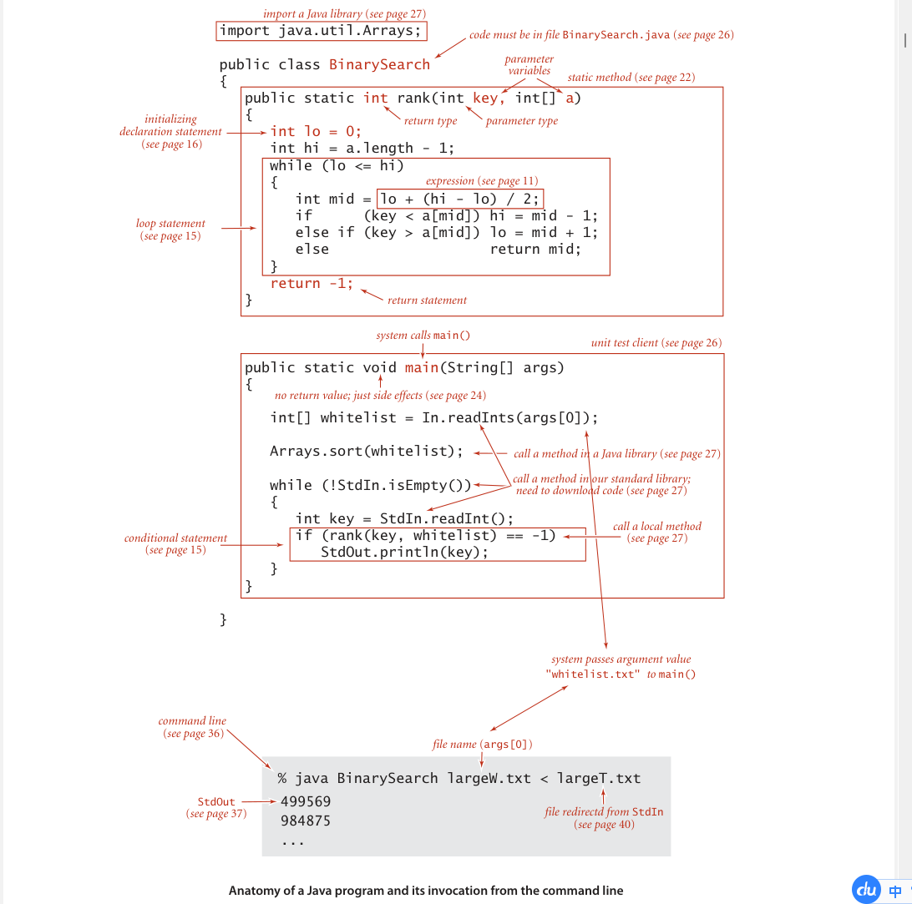

Our study of algorithms is based upon implementing them as programs written in
the Java programming language. We do so for several reasons:

- Our programs are `concise adj. 简明的，简洁的`, `elegant adj. 优雅的，精美的，雅致的`, and complete descriptions of algorithms.
- You can run the programs to study properties of the algorithms.
- You can put the algorithms immediately to good use in applications.

These are important and significant advantages over the alternatives of working with
English-language descriptions of algorithms.

A potential downside to this approach is that we have to work with a specific pro-
gramming language, possibly making it difficult to separate the idea of the algorithm
from the details of its implementation. Our implementations are designed to mitigate
this difficulty, by using programming constructs that are both found in many modern
languages and needed to adequately describe the algorithms.

We use only a small subset of Java. While we stop short of formally defining the
subset that we use, you will see that we make use of relatively few Java constructs, and
that we emphasize those that are found in many modern programming languages. The
code that we present is complete, and our expectation is that you will download it and
execute it, on our test data or test data of your own choosing.

We refer to the programming constructs, software libraries, and operating system
features that we use to implement and describe algorithms as our programming model.
In this section and Section 1.2, we fully describe this programming model. The treat-
ment is self-contained and primarily intended for documentation and for your refer-
ence in understanding any code in the book. The model we describe is the same model
introduced in our book An Introduction to Programming in Java: An Interdisciplinary
Approach, which provides a slower-paced introduction to the material.

For reference, the figure on the facing page depicts a complete Java program that
illustrates many of the basic features of our programming model. We use this code for
examples when discussing language features, but defer considering it in detail to page
46 (it implements a classic algorithm known as binary search and tests it for an applica-
tion known as whitelist filtering). We assume that you have experience programming
in some modern language, so that you are likely to recognize many of these features in
this code. Page references are included in the annotations to help you find answers to
any questions that you might have. Since our code is somewhat stylized and we strive
to make consistent use of various Java idioms and constructs, it is worthwhile even for
experienced Java programmers to read the information in this section.

