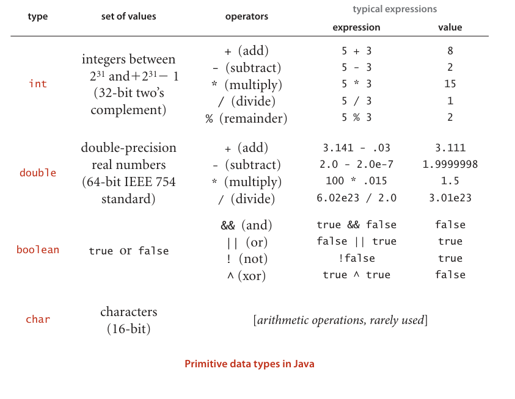
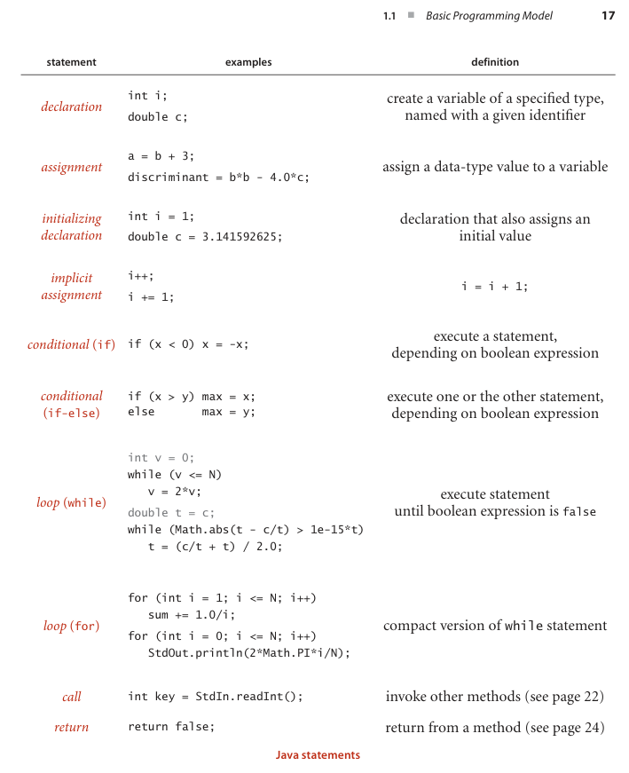
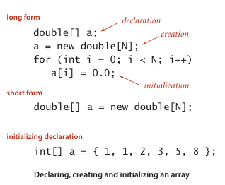

## 1.1 BASIC PROGRAMMING MODEL
Our study of algorithms is based upon implementing them as programs written in the Java programming language. We do so for several reasons:

- Our programs are `concise adj. 简明的，简洁的`, `elegant adj. 优雅的，精美的，雅致的`, and complete descriptions of algorithms.
- You can run the programs to study `properties n. 财产；性质，性能` of the algorithms.
- You can put the algorithms immediately to good use in applications.

These are important and significant advantages over the alternatives of working with English-language descriptions of algorithms.

A potential `downside n. 缺点，不利方面` to this approach is that we have to work with a specific programming language, possibly making it difficult to ***separate*** the idea of the algorithm ***from*** the details of its implementation. Our implementations are designed to `mitigate v. <正式>减轻，缓和` this difficulty, by using programming `constructs n. 构想，观念；建筑物，创造物；结构体` that are both found in many modern languages and needed to `adequately adv. 充分地，足够地；适当地` describe the algorithms.

We use only a small `subset n. [数] 子集` of Java. While we stop short of formally defining the subset that we use, you will see that we make use of ~~relatively~~ few Java constructs, and that we emphasize those that are found in many modern programming languages. The code that we present is complete, and our expectation is that you will download it and execute it, on our test data or test data of your own choosing.

We `refer to 提及，谈到` the programming constructs, software libraries, and operating system features that we use to implement and describe algorithms as our programming model.In this section and Section 1.2, we fully describe this programming model. The treatment is `self-contained adj. 独立的` and primarily ***intended for 旨在*** documentation and ***for*** your reference in understanding any code in the book. The model we describe is the same model introduced in our book An Introduction to Programming in Java: An Interdisciplinary Approach, which provides a `slower-paced 慢节奏的` introduction to the `material 材料，这里指书的内容?`.

For reference, the `figure （书中的）图、表` on the facing page `depicts v. 描述，描绘` a complete Java program that illustrates many of the basic features of our programming model. We use this code for examples when discussing language features, but `defer v. 延期，推迟；听从` considering it in detail to page 46 (it implements a classic algorithm known as binary search and tests it for an application known as whitelist filtering). We assume that you have experience programming in some modern language, so that you are likely to recognize many of these features in this code. Page references are included in the `annotations 注释` to help you find answers to any questions that you might have. Since our code is somewhat stylized and we `strive to 尽力做某事` make consistent use of various Java `idioms 风格，特色` and constructs, it is worthwhile even for experienced Java programmers to read the information in this section.


### Basic structure of a Java program
A Java program ( class) is ***either*** a library of static methods (functions) ***or*** a data type definition. To create libraries of static methods and data-type definitions, we use the following five components, the basis of programming in Java and many other modern languages:

- **Primitive data types** ~~precisely~~ define the meaning of `terms 术语 ` like integer, real number, and boolean value within a computer program. Their definition includes the set of possible values and operations on those values, which can be combined into expressions like mathematical expressions that define values.

- **Statements** allow us to define a computation by creating and ***assigning*** values ***to*** variables, controlling execution flow, or causing `side effects 副作用`. We use six types of statements: declarations, `assignments 赋值`, conditionals, loops, calls, and returns.

- **Arrays** allow us to work with multiple values of the same type.

- **Static methods** allow us to `encapsulate vt. 封装` and reuse code and to develop programs as a set of independent modules.

- **Strings** are sequences of characters. Some operations on them are built in to Java.
  
- **Input/output** `sets up 建立，创立` communication between programs and the outside world.

- **Data abstraction** extends encapsulation and reuse to allow us to define non-primitive data types, thus supporting `object-oriented 面向对象` programming.

In this section, we will consider the first five of these `in turn 依次，轮流`. Data abstraction is the topic of the next section.

Running a Java program involves interacting with an operating system or a program development environment. ~~For clarity and economy,~~ we describe such actions `in terms of 用……来表示,就……而言` a virtual terminal, where we interact with programs by typing commands to the system. See the booksite for details on using a `virtual 虚拟的，模拟的` terminal on your system, or for information on using one of the many more advanced program development environments that are available on modern systems.

For example, BinarySearch is two static methods, rank() and main(). The first static method, rank(), is four statements: two declarations, a loop (which is itself an assignment and two conditionals), and a return. The second, main(), is three statements:a declaration, a call, and a loop (which is itself an assignment and a conditional).

To invoke a Java program, we first compile it using the javac command, then run it using the java command. For example, to run BinarySearch, we first type the command javac BinarySearch.java (which creates a file BinarySearch.class that contains a lower-level version of the program in Java bytecode in the file BinarySearch.class).Then we type java BinarySearch (followed by a whitelist file name) to ***transfer*** control ***to*** the bytecode version of the program. To develop a basis for understanding the effect of these actions, we next consider in detail primitive data types and expressions, the various kinds of Java statements, arrays, static methods, strings, and input/output.

### `Primitive adj. 原始的，远古的` data types and expressions
A data type is a set of values and a set of operations on those values. We begin by considering the following four primitive data
types that are the basis of the Java language:
- **Integers**, with `arithmetic adj. 算术的 n. 算术` operations (int)
- **Real numbers 实数**, again with arithmetic operations (double)
- **Booleans**, the set of values { true, false } with logical operations (boolean)
- **Characters**, the `alphanumeric [ˌælfənuːˈmerɪk] 字母数字的` characters and symbols that you type (char) 

Next we consider mechanisms for specifying values and operations for these types.

A Java program `manipulates 操作` variables that are named with `identifier 标识符`. Each variable is ***associated with*** a data type and stores one of the permissible data-type values. In Java code, we use expressions like familiar mathematical expressions to apply the operations associated with each type. For primitive types, we use identifiers to refer to variables, operator symbols such as + - * / to specify operations, `literals 文字` such as 1 or 3.14 to specify values, and expressions such as (x + 2.236)/2 to specify operations on values. The purpose of an expression is to define one of the data-type values.

|term|examples|definition|
|:----:|:----:|:----:|
|primitive data type | int double boolean char| a set of values and a set of operations on those values (built in to the Java language) |
|`identifier 标识符`|a abc Ab$ a_b ab123 lo hi|a sequence of `letters 字母`, digits,_, and $, the first of which is not a digit|
|variable|[any identifier]|names a data-type value|
|operator|+ - * /|names a data-type operation|
|literal|<br>int 1 0 -42 </br> <br>double 2.0 1.0e-15 3.14 </br> <br>boolean true false </br> <br>char 'a' '+' '9' '\n'</br>|source-code representation of a value|
|expression|<br>int lo + (hi - lo)/2</br> <br></br>double 1.0e-15 * t <br>boolean lo <= hi</br>|a literal, a variable, or a sequence of operations on literals and/or variables that produces a value|

To define a data type, we need only specify the values and the set of operations on those values. This information is summarized in the table below for Java’s int, double, boolean, and char data types. These data types are similar to the basic data types found in many programming languages. For int and double, the operations are familiar arithmetic operations; for boolean, they are familiar logical operations. It is important to note that +, -, *, and / are overloaded—the same `symbol 符号` specifies operations in multiple different types, depending on context. The key property of these primitive operations is that an operation involving values of a given type has a value of that type. This rule highlights the idea that we are often working with `approximate values 近似值`, since it is often the case that the exact value that would seem to be defined by the expression is not a value of the type. For example, 5/3 has the value 1 and 5.0/3.0 has a value very close to 1.66666666666667 but neither of these is exactly equal to 5/3. This table is far from complete; we discuss some additional operators and various exceptional situations that we occasionally need to consider in the Q&A at the end of this section.



**Expressions**. As illustrated in the table at the bottom of the previous page, typical expressions are `infix n. 中缀`: a literal (or an expression), followed by an operator, followed by another literal (or another expression). When an expression contains more than one operator, the order in which they are applied is often significant, so the following precedence `conventions n.惯例；大会，集会；公约，协定` are part of the Java language specification: The operators * and / ( and %) have higher precedence than (are applied before) the + and - operators; among logical operators, ! is the highest precedence, followed by && and then ||. Generally, operators of the same precedence are applied left to right. As in standard arithmetic expressions, you can use `parentheses n. 圆括号` to override these rules. Since precedence rules vary slightly from language to language, we use parentheses and otherwise `strive to 努力` avoid dependence on precedence rules in our code. 

**Type conversion 类型转换**.Numbers are automatically ***promoted to 晋升*** a more inclusive type if no information is lost. For example, in the expression 1 + 2.5 , the 1 is promoted to the double value 1.0 and the expression evaluates to the double value 3.5 . A cast is a type name in parentheses within an expression, a directive to convert the following value into a value of that type. For example (int) 3.7 is 3 and (double) 3 is 3.0. Note that casting to an int is `truncation 截断` instead of `rounding—rules 舍入规则` for casting within complicated expressions can be `intricate adj. 错综复杂的；难理解的`, and casts should be used sparingly and with care. A best practice is to use expressions that involve literals or variables of a single type. 

**Comparisons**.The following operators compare two values of the same type and produce a boolean value: equal (==), not equal (!=), less than (<), less than or equal (<=), greater than (>), and greater than or equal (>=). These operators are known as mixed-type operators because their value is boolean, not the type of the values being compared. An expression with a boolean value is known as a boolean expression. Such expressions are essential components in conditional and loop statements, as we will see.

**Other primitive types**.Java’s int has $2^{32}$ different values by design, so it can be represented in a 32-bit machine word (many machines have 64-bit words nowadays, but the 32-bit int persists). Similarly, the double standard specifies a 64-bit representation. These data-type sizes are adequate for typical applications that use integers and real numbers. To provide flexibility, Java has five additional primitive data types: 

- 64-bit integers, with arithmetic operations ( long) 
- 16-bit integers, with arithmetic operations ( short) 
- 16-bit characters, with arithmetic operations (char) 
- 8-bit integers, with arithmetic operations ( byte) 
- 32-bit single-precision real numbers, again with arithmetic operations ( float) 

We most often use int and double arithmetic operations in this book, so we do not consider the others (which are very similar) in further detail here.

### Statements 
A Java program is ***composed of*** statements, which define the computation by creating and manipulating variables, ***assigning*** data-type values ***to*** them, and controlling the flow of execution of such operations. Statements are often organized in blocks, sequences of statements within `curly braces 花括号`. 

- Declarations create variables of a specified type and name them with identifiers. 

- Assignments associate a data-type value (defined by an expression) with a variable. Java also has several `implicit 隐式的，隐的` assignment idioms for changing the value of a data-type value relative to its current value, such as `incrementing 增量` the value of an integer variable. 

- Conditionals provide for a simple change in the flow of execution—execute the statements in one of two blocks, depending on a specified condition.
 
- Loops provide for a more `profound 极深的, 深厚的, 深刻的` change in the flow of execution—execute the statements in a block as long as a given condition is true. 

- Calls and returns relate to static methods (see page 22), which provide another way to change the flow of execution and to organize code. 

A program is a sequence of statements, with declarations, assignments, conditionals, loops, calls, and returns. Programs typically have a `nested adj. 嵌套的，内装的` structure : a statement among the statements in a block within a conditional or a loop may itself be a conditional or a loop. For example, the while loop in rank() contains an if statement. Next, we consider each of these types of statements in turn. 

**Declarations**.A declaration statement associates a variable name with a type at compile time. Java requires us to use declarations to specify the names and types of variables. By doing so, we are being `explicit 详述的, 清楚的` about any computation that we are specifying. Java is said to be a strongly typed language, because the Java compiler checks for `consistency 一致性` (for example, it does not permit us to multiply a boolean and a double). Declarations can appear anywhere before a variable is first used—most often, we put them at the point of first use. The scope of a variable is the part of the program where it is defined. Generally the scope of a variable is ***composed of*** the statements that follow the declaration in the same block as the declaration. 

**Assignments**.An assignment statement associates a data-type value (defined by an expression) with a variable. When we write c = a + b in Java, we are not expressing mathematical equality, but are instead expressing an action: set the value of the variable c to be the value of a plus the value of b. It is true that c is mathematically equal to a + b immediately after the assignment statement has been executed, but the point of the statement is to change the value of c (if necessary). The left-hand side of an assignment statement must be a single variable; the right-hand side can be an arbitrary expression that produces a value of the type.

**Conditionals**. Most computations require different actions for different inputs. One way to express these differences in Java is the if statement:
```java
if (<boolean expression>) { <block statements> }
```
This description introduces a formal `notation n. （音乐、数学等的）标记系统，成套符号，标记法；注释，评注` known as a template that we use occasionally to specify the format of Java constructs. We put within angle brackets (< >) a construct that we have already defined, to indicate that we can use any instance of that construct where specified. In this case, <boolean expression> represents an expression that has a boolean value, such as one involving a comparison operation, and < block statements> represents a sequence of Java statements. It is possible to make formal definitions of <boolean expression> and <block statements>, but we refrain from going into that level of detail. The meaning of an if statement is self-explanatory: the statement(s) in the block are to be executed if and only if the boolean expression is true. The if-else statement:
```java
if (<boolean expression>) { <block statements> }
else { <block statements> }
```
allows for choosing between two alternative blocks of statements.

**Loops**. Many computations are `inherently 本质上` repetitive. The basic Java construct for handling such computations has the following format:
```java
while (<boolean expression>) { <block statements> }
```
The while statement has the same form as the if statement (the only difference being the use of the keyword while instead of if), but the meaning is quite different. It is an `instruction instruction n. 指令, 教导, 命令[计] 指令` to the computer to behave as follows: if the boolean expression is false, do nothing; if the boolean expression is true, execute the sequence of statements in the block (just as with if) but then check the boolean expression again, execute the sequence of statements in the block again if the boolean expression is true, and continue as long as the boolean expression is true. We refer to the statements in the block in a loop as the body of the loop.

**Break and continue**. Some situations call for slightly more complicated control flow than provide by the basic if and while statements. Accordingly, Java supports two additional statements for use within while loops: 
- The break statement, which immediately exits the loop 
- The continue statement, which immediately begins the next iteration of the loop 

We rarely use these statements in the code in this book (and many programmers never use them), but they do considerably simplify code in certain instances.

### Shortcut notations 简便记法
There are several ways to express a given computation; we seek clear, elegant, and efficient code. Such code often takes advantage of the following widely used shortcuts (that are found in many languages, not just Java).

**Initializing declarations**. We can combine a declaration with an assignment to initialize a variable at the same time that it is declared (created). For example, the code int i = 1; creates an int variable named i and assigns it the initial value 1. A best practice is to use this mechanism close to first use of the variable (to limit scope). 

**Implicit assignments**. The following `shortcuts n. 捷径` are available when our purpose is to modify a variable’s value relative to its current value: 
- Increment/decrement operators: i++ is the same as i = i + 1 and has the value i in an expression. Similarly, i-- is the same as i = i - 1. The code ++i and --i are the same except that the expression value is taken after the increment/decrement, not before. 
- Other `compound 复合的, 混合的` operations: `Prepending 前置 (prepend vt. 预先考虑；预谋)` a binary operator to the = in an assignment is equivalent to using the variable on the left as the first `operand 操作数`. For example, the code i/=2; is equivalent to the code i = i/2; Note that i += 1; has the same effect as i = i+1; (and i++). 

**Single-statement blocks**. If a block of statements in a conditional or a loop has only a single statement, the curly braces may be `omitted 省略`. 

**For notation**. Many loops follow this scheme: initialize an index variable to some value and then use a while loop to test a loop `continuation n. 连续，持续` condition involving the index variable, where the last statement in the while loop increments the index variable. You can express such loops `compactly adv. 简洁地；紧密地` with Java’s for notation:
```java
for (<initialize>; <boolean expression>; <increment>)
{
    <block statements>
}
```
This code is, with only a few exceptions, `equivalent adj. 等同的，等效的` to
```java
<initialize>;
while (<boolean expression>)
{
    <block statements>
    <increment>;
}
```
We use for loops to support this initialize-and-increment programming idiom.



### Arrays 
An array stores a sequence of values that are all of the same type. We want not only to store values but also to access each individual value. The method that we use to refer to individual values in an array is `numbering 编号` and then indexing them. If we have N values, we think of them as being numbered from 0 to N-1. Then, we can unambiguously specify one of them in Java code by using the notation a[i] to refer to the ith value for any value of i from 0 to N-1. This Java construct is known as a one-dimensional array. 

Creating and initializing an array. Making an array in a Java program involves three distinct steps: 
- Declare the array name and type. 
- Create the array. 
- Initialize the array values.

To declare the array, you need to specify a name and the type of data it will contain. To create it, you need to specify its length (the number of values). For example, the “long form” code shown at right makes an array of N numbers of type double, all initialized to 0.0. The first statement is the array declaration. It is just like a declaration of a variable of the corresponding primitive type except for the square brackets following the type name, which specify that we are declaring an array. The keyword new in the second statement is a Java directive to create the array. The reason that we need to explicitly create arrays at run time is that the Java compiler cannot know how much space to `reserve v. 预订；保留，预留` for the array at compile time (as it can for primitive-type values). The for statement initializes the N array values. This code sets all of the array entries to the value 0.0. When you begin to write code that uses an array, you must be sure that your code declares, creates, and initializes it. Omitting one of these steps is a common programming mistake.



