## 1.1 BASIC PROGRAMMING MODEL
Our study of algorithms is based upon implementing them as programs written in the Java programming language. We do so for several reasons:

- Our programs are `concise adj. 简明的，简洁的`, `elegant adj. 优雅的，精美的，雅致的`, and complete descriptions of algorithms.
- You can run the programs to study `properties n. 财产；性质，性能` of the algorithms.
- You can put the algorithms immediately to good use in applications.

These are important and significant advantages over the alternatives of working with English-language descriptions of algorithms.

A potential `downside n. 缺点，不利方面` to this approach is that we have to work with a specific programming language, possibly making it difficult to ***separate*** the idea of the algorithm ***from*** the details of its implementation. Our implementations are designed to `mitigate v. <正式>减轻，缓和` this difficulty, by using programming `constructs n. 构想，观念；建筑物，创造物；结构体` that are both found in many modern languages and needed to `adequately adv. 充分地，足够地；适当地` describe the algorithms.

We use only a small `subset n. [数] 子集` of Java. While we stop short of formally defining the subset that we use, you will see that we make use of ~~relatively~~ few Java constructs, and that we emphasize those that are found in many modern programming languages. The code that we present is complete, and our expectation is that you will download it and execute it, on our test data or test data of your own choosing.

We `refer to 提及，谈到` the programming constructs, software libraries, and operating system features that we use to implement and describe algorithms as our programming model.In this section and Section 1.2, we fully describe this programming model. The treatment is `self-contained adj. 独立的` and primarily ***intended for 旨在*** documentation and ***for*** your reference in understanding any code in the book. The model we describe is the same model introduced in our book An Introduction to Programming in Java: An Interdisciplinary Approach, which provides a `slower-paced 慢节奏的` introduction to the `material 材料，这里指书的内容?`.

For reference, the `figure （书中的）图、表` on the facing page `depicts v. 描述，描绘` a complete Java program that illustrates many of the basic features of our programming model. We use this code for examples when discussing language features, but `defer v. 延期，推迟；听从` considering it in detail to page 46 (it implements a classic algorithm known as binary search and tests it for an application known as whitelist filtering). We assume that you have experience programming in some modern language, so that you are likely to recognize many of these features in this code. Page references are included in the `annotations 注释` to help you find answers to any questions that you might have. Since our code is somewhat stylized and we `strive to 尽力做某事` make consistent use of various Java `idioms 风格，特色` and constructs, it is worthwhile even for experienced Java programmers to read the information in this section.

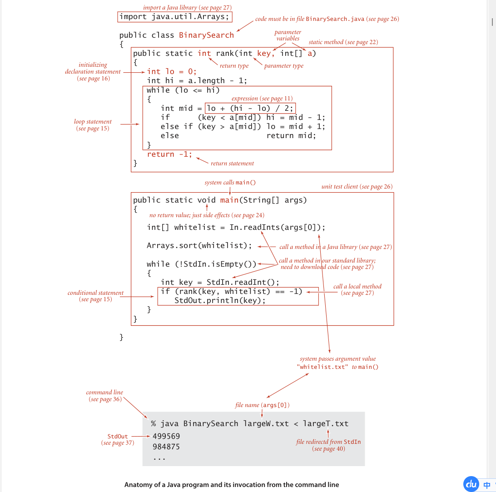

### Basic structure of a Java program
A Java program ( class) is ***either*** a library of static methods (functions) ***or*** a data type definition. To create libraries of static methods and data-type definitions, we use the following five components, the basis of programming in Java and many other modern languages:

- **Primitive data types** ~~precisely~~ define the meaning of `terms 术语 ` like integer, real number, and boolean value within a computer program. Their definition includes the set of possible values and operations on those values, which can be combined into expressions like mathematical expressions that define values.

- **Statements** allow us to define a computation by creating and ***assigning*** values ***to*** variables, controlling execution flow, or causing `side effects 副作用`. We use six types of statements: declarations, `assignments 赋值`, conditionals, loops, calls, and returns.

- **Arrays** allow us to work with multiple values of the same type.

- **Static methods** allow us to `encapsulate vt. 封装` and reuse code and to develop programs as a set of independent modules.

- **Strings** are sequences of characters. Some operations on them are built in to Java.
  
- **Input/output** `sets up 建立，创立` communication between programs and the outside world.

- **Data abstraction** extends encapsulation and reuse to allow us to define non-primitive data types, thus supporting `object-oriented 面向对象` programming.

In this section, we will consider the first five of these `in turn 依次，轮流`. Data abstraction is the topic of the next section.

Running a Java program involves interacting with an operating system or a program development environment. ~~For clarity and economy,~~ we describe such actions `in terms of 用……来表示,就……而言` a virtual terminal, where we interact with programs by typing commands to the system. See the booksite for details on using a `virtual 虚拟的，模拟的` terminal on your system, or for information on using one of the many more advanced program development environments that are available on modern systems.

For example, BinarySearch is two static methods, rank() and main(). The first static method, rank(), is four statements: two declarations, a loop (which is itself an assignment and two conditionals), and a return. The second, main(), is three statements:a declaration, a call, and a loop (which is itself an assignment and a conditional).

To invoke a Java program, we first compile it using the javac command, then run it using the java command. For example, to run BinarySearch, we first type the command javac BinarySearch.java (which creates a file BinarySearch.class that contains a lower-level version of the program in Java bytecode in the file BinarySearch.class).Then we type java BinarySearch (followed by a whitelist file name) to ***transfer*** control ***to*** the bytecode version of the program. To develop a basis for understanding the effect of these actions, we next consider in detail primitive data types and expressions, the various kinds of Java statements, arrays, static methods, strings, and input/output.

### `Primitive adj. 原始的，远古的` data types and expressions
A data type is a set of values and a set of operations on those values. We begin by considering the following four primitive data
types that are the basis of the Java language:
- **Integers**, with `arithmetic adj. 算术的 n. 算术` operations (int)
- **Real numbers 实数**, again with arithmetic operations (double)
- **Booleans**, the set of values { true, false } with logical operations (boolean)
- **Characters**, the `alphanumeric [ˌælfənuːˈmerɪk] 字母数字的` characters and symbols that you type (char) 

Next we consider mechanisms for specifying values and operations for these types.

A Java program `manipulates 操作` variables that are named with `identifier 标识符`. Each variable is ***associated with*** a data type and stores one of the permissible data-type values. In Java code, we use expressions like familiar mathematical expressions to apply the operations associated with each type. For primitive types, we use identifiers to refer to variables, operator symbols such as + - * / to specify operations, `literals 文字` such as 1 or 3.14 to specify values, and expressions such as (x + 2.236)/2 to specify operations on values. The purpose of an expression is to define one of the data-type values.

|term|examples|definition|
|:----:|:----:|:----:|
|primitive data type | int double boolean char| a set of values and a set of operations on those values (built in to the Java language) |
|`identifier 标识符`|a abc Ab$ a_b ab123 lo hi|a sequence of `letters 字母`, digits,_, and $, the first of which is not a digit|
|variable|[any identifier]|names a data-type value|
|operator|+ - * /|names a data-type operation|
|literal|<br>int 1 0 -42 </br> <br>double 2.0 1.0e-15 3.14 </br> <br>boolean true false </br> <br>char 'a' '+' '9' '\n'</br>|source-code representation of a value|
|expression|<br>int lo + (hi - lo)/2</br> <br></br>double 1.0e-15 * t <br>boolean lo <= hi</br>|a literal, a variable, or a sequence of operations on literals and/or variables that produces a value|

To define a data type, we need only specify the values and the set of operations on those values. This information is summarized in the table below for Java’s int, double, boolean, and char data types. These data types are similar to the basic data types found in many programming languages. For int and double, the operations are familiar arithmetic operations; for boolean, they are familiar logical operations. It is important to note that +, -, *, and / are overloaded—the same `symbol 符号` specifies operations in multiple different types, depending on context. The key property of these primitive operations is that an operation involving values of a given type has a value of that type. This rule highlights the idea that we are often working with `approximate values 近似值`, since it is often the case that the exact value that would seem to be defined by the expression is not a value of the type. For example, 5/3 has the value 1 and 5.0/3.0 has a value very close to 1.66666666666667 but neither of these is exactly equal to 5/3. This table is far from complete; we discuss some additional operators and various exceptional situations that we occasionally need to consider in the Q&A at the end of this section.

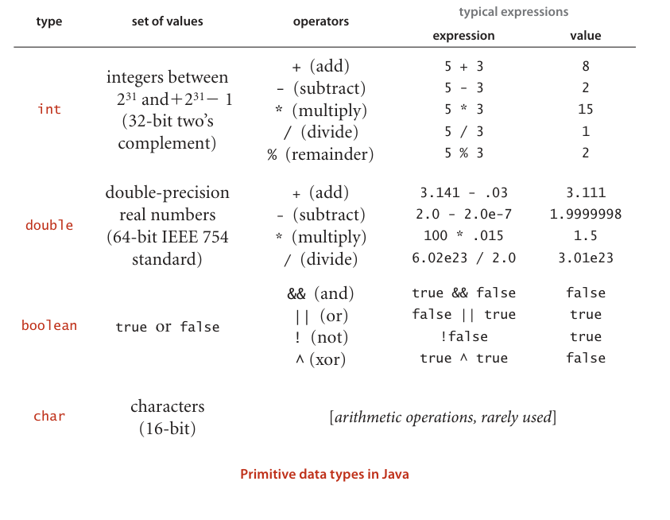

**Expressions**. As illustrated in the table at the bottom of the previous page, typical expressions are `infix n. 中缀`: a literal (or an expression), followed by an operator, followed by another literal (or another expression). When an expression contains more than one operator, the order in which they are applied is often significant, so the following precedence `conventions n.惯例；大会，集会；公约，协定` are part of the Java language specification: The operators * and / ( and %) have higher precedence than (are applied before) the + and - operators; among logical operators, ! is the highest precedence, followed by && and then ||. Generally, operators of the same precedence are applied left to right. As in standard arithmetic expressions, you can use `parentheses n. 圆括号` to override these rules. Since precedence rules vary slightly from language to language, we use parentheses and otherwise `strive to 努力` avoid dependence on precedence rules in our code. 

**Type conversion 类型转换**.Numbers are automatically ***promoted to 晋升*** a more inclusive type if no information is lost. For example, in the expression 1 + 2.5 , the 1 is promoted to the double value 1.0 and the expression evaluates to the double value 3.5 . A cast is a type name in parentheses within an expression, a directive to convert the following value into a value of that type. For example (int) 3.7 is 3 and (double) 3 is 3.0. Note that casting to an int is `truncation 截断` instead of `rounding—rules 舍入规则` for casting within complicated expressions can be `intricate adj. 错综复杂的；难理解的`, and casts should be used sparingly and with care. A best practice is to use expressions that involve literals or variables of a single type. 

**Comparisons**.The following operators compare two values of the same type and produce a boolean value: equal (==), not equal (!=), less than (<), less than or equal (<=), greater than (>), and greater than or equal (>=). These operators are known as mixed-type operators because their value is boolean, not the type of the values being compared. An expression with a boolean value is known as a boolean expression. Such expressions are essential components in conditional and loop statements, as we will see.

**Other primitive types**.Java’s int has $2^{32}$ different values by design, so it can be represented in a 32-bit machine word (many machines have 64-bit words nowadays, but the 32-bit int persists). Similarly, the double standard specifies a 64-bit representation. These data-type sizes are adequate for typical applications that use integers and real numbers. To provide flexibility, Java has five additional primitive data types: 

- 64-bit integers, with arithmetic operations ( long) 
- 16-bit integers, with arithmetic operations ( short) 
- 16-bit characters, with arithmetic operations (char) 
- 8-bit integers, with arithmetic operations ( byte) 
- 32-bit single-precision real numbers, again with arithmetic operations ( float) 

We most often use int and double arithmetic operations in this book, so we do not consider the others (which are very similar) in further detail here.

### Statements 
A Java program is ***composed of*** statements, which define the computation by creating and manipulating variables, ***assigning*** data-type values ***to*** them, and controlling the flow of execution of such operations. Statements are often organized in blocks, sequences of statements within `curly braces 花括号`. 

- Declarations create variables of a specified type and name them with identifiers. 

- Assignments associate a data-type value (defined by an expression) with a variable. Java also has several `implicit 隐式的，隐的` assignment idioms for changing the value of a data-type value relative to its current value, such as `incrementing 增量` the value of an integer variable. 

- Conditionals provide for a simple change in the flow of execution—execute the statements in one of two blocks, depending on a specified condition.
 
- Loops provide for a more `profound 极深的, 深厚的, 深刻的` change in the flow of execution—execute the statements in a block as long as a given condition is true. 

- Calls and returns relate to static methods (see page 22), which provide another way to change the flow of execution and to organize code. 

A program is a sequence of statements, with declarations, assignments, conditionals, loops, calls, and returns. Programs typically have a `nested adj. 嵌套的，内装的` structure : a statement among the statements in a block within a conditional or a loop may itself be a conditional or a loop. For example, the while loop in rank() contains an if statement. Next, we consider each of these types of statements in turn. 

**Declarations**.A declaration statement associates a variable name with a type at compile time. Java requires us to use declarations to specify the names and types of variables. By doing so, we are being `explicit 详述的, 清楚的` about any computation that we are specifying. Java is said to be a strongly typed language, because the Java compiler checks for `consistency 一致性` (for example, it does not permit us to multiply a boolean and a double). Declarations can appear anywhere before a variable is first used—most often, we put them at the point of first use. The scope of a variable is the part of the program where it is defined. Generally the scope of a variable is ***composed of*** the statements that follow the declaration in the same block as the declaration. 

**Assignments**.An assignment statement associates a data-type value (defined by an expression) with a variable. When we write c = a + b in Java, we are not expressing mathematical equality, but are instead expressing an action: set the value of the variable c to be the value of a plus the value of b. It is true that c is mathematically equal to a + b immediately after the assignment statement has been executed, but the point of the statement is to change the value of c (if necessary). The left-hand side of an assignment statement must be a single variable; the right-hand side can be an arbitrary expression that produces a value of the type.

**Conditionals**. Most computations require different actions for different inputs. One way to express these differences in Java is the if statement:
```java
if (<boolean expression>) { <block statements> }
```
This description introduces a formal `notation n. （音乐、数学等的）标记系统，成套符号，标记法；注释，评注` known as a template that we use occasionally to specify the format of Java constructs. We put within angle brackets (< >) a construct that we have already defined, to indicate that we can use any instance of that construct where specified. In this case, <boolean expression> represents an expression that has a boolean value, such as one involving a comparison operation, and < block statements> represents a sequence of Java statements. It is possible to make formal definitions of <boolean expression> and <block statements>, but we refrain from going into that level of detail. The meaning of an if statement is self-explanatory: the statement(s) in the block are to be executed if and only if the boolean expression is true. The if-else statement:
```java
if (<boolean expression>) { <block statements> }
else { <block statements> }
```
allows for choosing between two alternative blocks of statements.

**Loops**. Many computations are `inherently 本质上` repetitive. The basic Java construct for handling such computations has the following format:
```java
while (<boolean expression>) { <block statements> }
```
The while statement has the same form as the if statement (the only difference being the use of the keyword while instead of if), but the meaning is quite different. It is an `instruction instruction n. 指令, 教导, 命令[计] 指令` to the computer to behave as follows: if the boolean expression is false, do nothing; if the boolean expression is true, execute the sequence of statements in the block (just as with if) but then check the boolean expression again, execute the sequence of statements in the block again if the boolean expression is true, and continue as long as the boolean expression is true. We refer to the statements in the block in a loop as the body of the loop.

**Break and continue**. Some situations call for slightly more complicated control flow than provide by the basic if and while statements. Accordingly, Java supports two additional statements for use within while loops: 
- The break statement, which immediately exits the loop 
- The continue statement, which immediately begins the next iteration of the loop 

We rarely use these statements in the code in this book (and many programmers never use them), but they do considerably simplify code in certain instances.

### Shortcut notations 简便记法
There are several ways to express a given computation; we seek clear, elegant, and efficient code. Such code often takes advantage of the following widely used shortcuts (that are found in many languages, not just Java).

**Initializing declarations**. We can combine a declaration with an assignment to initialize a variable at the same time that it is declared (created). For example, the code int i = 1; creates an int variable named i and assigns it the initial value 1. A best practice is to use this mechanism close to first use of the variable (to limit scope). 

**Implicit assignments**. The following `shortcuts n. 捷径` are available when our purpose is to modify a variable’s value relative to its current value: 
- Increment/decrement operators: i++ is the same as i = i + 1 and has the value i in an expression. Similarly, i-- is the same as i = i - 1. The code ++i and --i are the same except that the expression value is taken after the increment/decrement, not before. 
- Other `compound 复合的, 混合的` operations: `Prepending 前置 (prepend vt. 预先考虑；预谋)` a binary operator to the = in an assignment is equivalent to using the variable on the left as the first `operand 操作数`. For example, the code i/=2; is equivalent to the code i = i/2; Note that i += 1; has the same effect as i = i+1; (and i++). 

**Single-statement blocks**. If a block of statements in a conditional or a loop has only a single statement, the curly braces may be `omitted 省略`. 

**For notation**. Many loops follow this scheme: initialize an index variable to some value and then use a while loop to test a loop `continuation n. 连续，持续` condition involving the index variable, where the last statement in the while loop increments the index variable. You can express such loops `compactly adv. 简洁地；紧密地` with Java’s for notation:
```java
for (<initialize>; <boolean expression>; <increment>)
{
    <block statements>
}
```
This code is, with only a few exceptions, `equivalent adj. 等同的，等效的` to
```java
<initialize>;
while (<boolean expression>)
{
    <block statements>
    <increment>;
}
```
We use for loops to support this initialize-and-increment programming idiom.

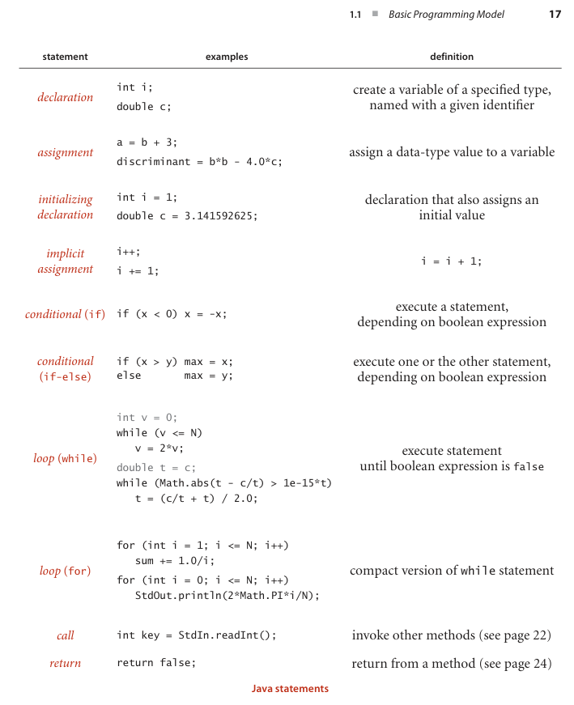

### Arrays 
An array stores a sequence of values that are all of the same type. We want not only to store values but also to access each individual value. The method that we use to refer to individual values in an array is `numbering 编号` and then indexing them. If we have N values, we think of them as being numbered from 0 to N-1. Then, we can unambiguously specify one of them in Java code by using the notation a[i] to refer to the ith value for any value of i from 0 to N-1. This Java construct is known as a one-dimensional array. 

**Creating and initializing an array**. Making an array in a Java program involves three distinct steps: 
- Declare the array name and type. 
- Create the array. 
- Initialize the array values.

To declare the array, you need to specify a name and the type of data it will contain. To create it, you need to specify its length (the number of values). For example, the “long form” code shown at right makes an array of N numbers of type double, all initialized to 0.0. The first statement is the array declaration. It is just like a declaration of a variable of the corresponding primitive type except for the square brackets following the type name, which specify that we are declaring an array. The keyword new in the second statement is a Java directive to create the array. The reason that we need to explicitly create arrays at run time is that the Java compiler cannot know how much space to `reserve v. 预订；保留，预留` for the array at compile time (as it can for primitive-type values). The for statement initializes the N array values. This code sets all of the array entries to the value 0.0. When you begin to write code that uses an array, you must be sure that your code declares, creates, and initializes it. Omitting one of these steps is a common programming mistake.

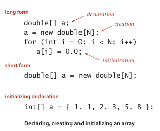

**Short form**. For economy in code, we often take advantage of Java’s default array initialization convention and combine all three steps into a single statement, as in the “short form” code in our example. The code to the left of the equal sign constitutes the declaration; the code to the right constitutes the creation. The for loop is unnecessary in this case because the default initial value of variables of type double in a Java array is 0.0, but it would be required if a nonzero value were desired. The default initial value is zero for numeric types and false for type boolean. The third option shown for our example is to specify the initialization values at compile time, by listing literal values between curly braces, separated by commas. 

**Using an array**. Typical array-processing code is shown on page 21. After declaring and creating an array, you can refer to any individual value anywhere you would use a variable name in a program by enclosing an integer index in square brackets after the array name. Once we create an array, its size is fixed. A program can refer to the length of an array a[] with the code a.length. The last element of an array a[] is always a[a.length-1]. Java does automatic bounds checking—if you have created an array of size N and use an index whose value is less than 0 or greater than N-1, your program will `terminate v. （使）结束，（使）终止` with an ArrayOutOfBoundsException runtime exception. 

**Aliasing 别名**. Note carefully that an array name refers to the whole array—if we assign one array name to another, **then both refer to the same array**, as illustrated in the following code fragment.
```java
int[] a = new int[N];
...
a[i] = 1234;
...
int[] b = a;
...
b[i] = 5678; // a[i] is now 5678.
```
This situation is known as aliasing and can ***lead to*** subtle bugs. If your intent is to make a copy of an array, then you need to declare, create, and initialize a new array and then copy all of the entries in the original array to the new array, as in the third example on page 21. 

**Two-dimensional arrays**. A two-dimensional array in Java is an array of one-dimensional arrays. A two-dimensional array may be `ragged 高低不平的，参差不齐的；不流畅的，不规则的` (its arrays may all be of differing lengths), but we most often work with (for appropriate parameters M and N) M-by-N two-dimensional arrays that are arrays of M rows, each an array of length N (so it also makes sense to refer to the array as having N columns). Extending Java array constructs to handle two-dimensional arrays is straightforward. To refer to the entry in row i and column j of a two-dimensional array a[][], we use the notation a[i][j]; to declare a two-dimensional array, we add another pair of square brackets; and to create the array, we specify the number of rows followed by the number of columns after the type name (both within square brackets), as follows:
```java
double[][] a = new double[M][N];
```

We refer to such an array as an M-by-N array. By convention, the first dimension is the number of rows and the second is the number of columns. As with one-dimensional arrays, Java initializes all entries in arrays of numeric types to zero and in arrays of boolean values to false. Default initialization of two-dimensional arrays is useful because it masks more code than for one-dimensional arrays. The following code is equivalent to the single-line create-and-initialize idiom that we just considered:
```java
double[][] a;
a = new double[M][N];
for (int i = 0; i < M; i++)
    for (int j = 0; j < N; j++)
        a[i][j] = 0.0;
```
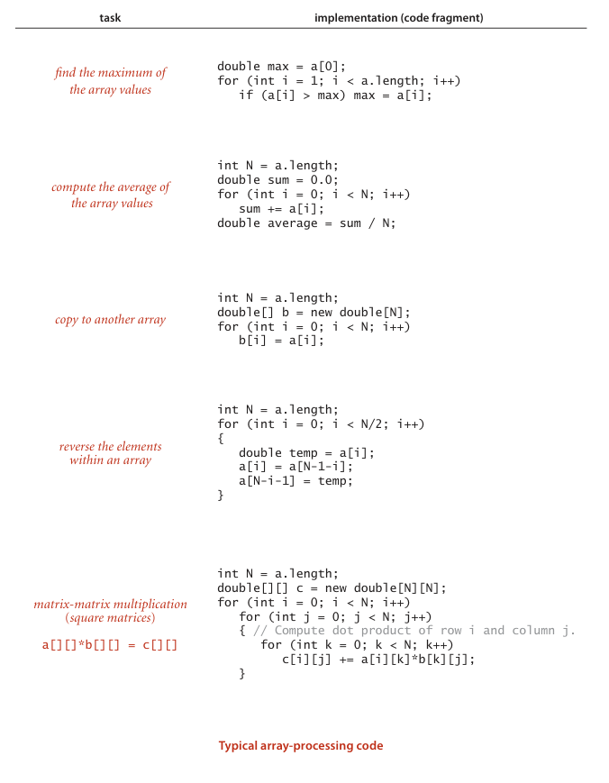

### Static methods
Every Java program in this book is either a data-type definition (which we describe in detail in Section 1.2) or a library of static methods (which we describe here). Static methods are called functions in many programming languages, since they can behave like mathematical functions, as described next. Each static method is a sequence of statements that are executed, one after the other, when the static method is called, `in the manner 以某种方式或风格` described below. The modifier static ***distinguishes*** these methods ***from*** instance methods, which we discuss in Section 1.2. We use the word method without a modifier when describing `characteristics n. 特性，特征；特色` shared by both kinds of methods. 

**Defining a static method**. A method encapsulates a computation that is defined as a sequence of statements. A method takes arguments (values of given data types) and computes a return value of some data type that depends upon the arguments (such as a value defined by a mathematical function) or causes a side effect that depends on the arguments (such as printing a value). The static method rank() in BinarySearch is an example of the first; main() is an example of the second. Each static method is ***composed of*** a signature (the keywords public static followed by a return type, the method name, and a sequence of arguments, each with a declared type) and a body (a statement block: a sequence of statements, enclosed in curly braces). Examples of static methods are shown in the table on the facing page. 

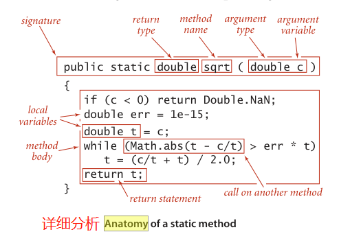

**Invoking a static method**. A call on a static method is its name followed by expressions that specify argument values in parentheses, separated by commas. When the method call is part of an expression, the method computes a value and that value is used ***in place of*** the call in the expression. For example the call on rank() in BinarySearch() returns an int value. A method call followed by a `semicolon n. 分号` is a statement that generally causes side effects. For example, the call Arrays.sort() in main() in BinarySearch is a call on the system method Arrays.sort() that has the side effect of putting the entries in the array in sorted order. When a method is called, its argument variables are initialized with the values of the corresponding expressions in the call. A return statement terminates a static method, returning control to the caller. If the static method is to compute a value, that value must be specified in a return statement (if such a static method can reach the end of its sequence of statements without a return, the compiler will report the error).

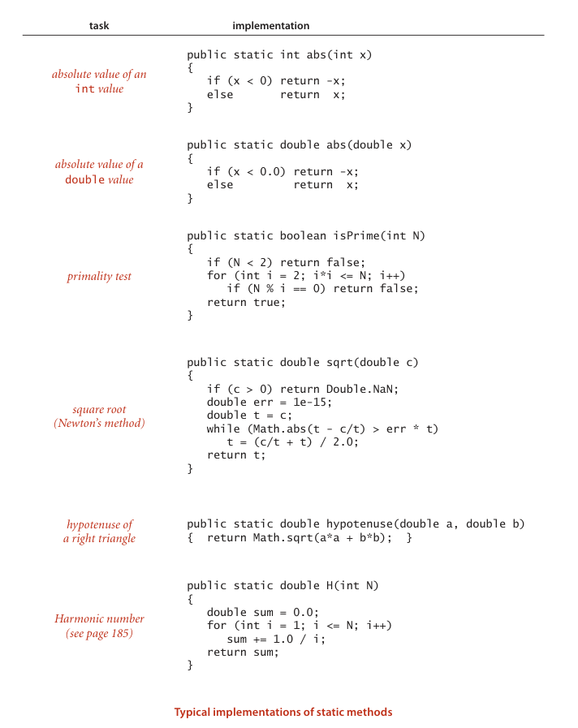

**Properties of methods**. A complete detailed description of the properties of methods is beyond our scope, but the following points are worth noting: 

- Arguments are passed by value. You can use argument variables anywhere in the code in the body of the method in the same way you use local variables. The only difference ***between*** an argument variable ***and*** a local variable is that the argument variable is initialized with the argument value provided by the calling code. The method works with the value of its arguments, not the arguments themselves. One consequence of this approach is that changing the value of an argument variable within a static method has no effect on the calling code. Generally, we do not change argument variables in the code in this book. The passby-value convention implies that array arguments are aliased (see page 19)—the method uses the argument variable to refer to the caller’s array and can change the contents of the array (though it cannot change the array itself). For example, Arrays.sort() certainly changes the contents of the array passed as argument: it puts the entries in order. 

- Method names can be overloaded. For example, the Java Math library uses this approach to provide implementations of Math.abs(), Math.min(), and Math.max() for all primitive numeric types. Another common use of overloading is to define two different versions of a function, one that takes an argument and another that uses a default value of that argument. 

- A method has a single return value but may have multiple return statements. A Java method can provide only one return value, of the type declared in the method signature. Control goes back to the calling program as soon as the first return statement in a static method is reached. You can put return statements wherever you need them. Even though there may be multiple return statements, any static method returns a single value each time it is invoked: the value following the first return statement `encountered v. 遇到；曾遭遇`. 

- A method can have side effects. A method may use the keyword void as its return type, to indicate that it has no return value. An explicit return is not necessary in a void static method: control returns to the caller after the last statement. A void static method is said to produce side effects (consume input, produce output, change entries in an array, or otherwise change the state of the system). For example, the main() static method in our programs has a void return type because its purpose is to produce output. Technically, void methods do not implement mathematical functions (and neither does Math.random(), which takes no arguments but does produce a return value). 

The instance methods that are the `subject n. 主题，话题；学科，科目，课程` of Section 2.1 share these properties, though profound differences surround the issue of side effects.

**Recursion**. A method can call itself (if you are not comfortable with this idea, known as recursion, you are encouraged to work Exercises 1.1.16 through 1.1.22). For example, the code at the bottom of this page gives an alternate implementation of the rank() method in BinarySearch. We often use recursive implementations of methods because they can lead to compact, elegant code that is easier to understand than a corresponding implementation that does not use recursion. For example, the `comment （计算机）注解` in the implementation below provides a `succinct adj. 言简意赅的，简练的` description of what the code is supposed to do. We can use this comment to convince ourselves that it operates correctly, by mathematical induction. We will expand on this topic and provide such a proof for binary search in Section 3.1. There are three important rules of thumb in developing recursive programs: 

- The recursion has a base case—we always include a conditional statement as the first statement in the program that has a return. 

- Recursive calls must `address subproblems 解决子问题` that are smaller in some sense, so that recursive calls `converge v. （使）汇聚，集中；（观点、目标）趋同；（数）收敛` to the base case. In the code below, the difference between the values of the fourth and the third arguments always decreases. 

- Recursive calls should not address subproblems that `overlap v. （与……）互搭，（与……）复叠`. In the code below, the portions of the array referenced by the two subproblems are `disjoint adj. 不连贯的；（两个集合）不相交的`. 

Violating any of these guidelines is likely to ***lead to*** incorrect results or a `spectacularly 令人印象深刻地，非常` inefficient program (see Exercises 1.1.19 and 1.1.27). ***Adhering to 坚持，遵循*** them is likely to lead to a clear and correct program whose performance is easy to understand. Another reason to use recursive methods is that they lead to mathematical models that we can use to understand performance. We address this issue for binary search in Section 3.2 and in several other instances throughout the book.


```java
public static int rank(int key, int[] a)
{ return rank(key, a, 0, a.length - 1); }

public static int rank(int key, int[] a, int lo, int hi)
{ // Index of key in a[], if present, is not smaller than lo
    // and not larger than hi.
    if (lo > hi) return -1;
    int mid = lo + (hi - lo) / 2;
    if (key < a[mid]) return rank(key, a, lo, mid - 1);
    else if (key > a[mid]) return rank(key, a, mid + 1, hi);
    else return mid;
}
```

**Basic programming model**. A library of static methods is a set of static methods that are defined in a Java class, by creating a file with the keywords public class followed by the class name, followed by the static methods, enclosed in braces, kept in a file with the same name as the class and a. java extension. A basic model for Java programming is to develop a program that addresses a specific `computational adj. 计算的` task by creating a library of static methods, one of which is named main(). Typing java followed by a class name followed by a sequence of strings leads to a call on main() in that class, with an array containing those strings as argument. After the last statement in main() executes, the program terminates. In this book, when we talk of a Java program for accomplishing a task, we are talking about code developed along these lines (possibly also including a data-type definition, as described in Section 1.2). For example, BinarySearch is a Java program ***composed of*** two static methods, rank() and main(), that accomplishes the task of printing numbers on an input stream that are not found in a whitelist file given as command-line argument. 

**Modular programming**. Of critical importance in this model is that libraries of static methods enable `modular 组合式的；模块化的；模数的` programming where we build libraries of static methods (modules) and a static method in one library can call static methods defined in other libraries. This approach has many important advantages. It allows us to 

- Work with modules of reasonable size, even in program involving a large amount of code 
- Share and reuse code without having to reimplement it 
- Easily substitute improved implementations 
- Develop appropriate abstract models for addressing programming problems 
- Localize debugging (see the paragraph below on unit testing) 

For example, BinarySearch makes use of three other independently developed libraries, our StdIn and In library and Java’s Arrays library. Each of these libraries, in turn, makes use of several other libraries. 

**Unit testing**. A best practice in Java programming is to include a main() in every library of static methods that tests the methods in the library (some other programming languages disallow multiple main() methods and thus do not support this approach). Proper unit testing can be a significant programming challenge in itself. `At a minimum 最低限度`, every module should contain a main() method that exercises the code in the module and provides some assurance that it works. `As a module matures 随着模块的成熟`, we often refine the main() method to be a development client that helps us do more detailed tests as we develop the code, or a test client that tests all the code extensively. As a client becomes more complicated, we might put it in an independent module. In this book, we use main() to help illustrate the purpose of each module and leave test clients for exercises.

**External libraries**. We use static methods from four different kinds of libraries, each requiring (slightly) differing procedures for code reuse. Most of these are libraries of static methods, but a few are data-type definitions that also include some static methods. 

- The standard system libraries java.lang.*. These include Math, which contains methods for commonly used mathematical functions; Integer and Double, which we use for converting between strings of characters and int and double values; String and StringBuilder, which we discuss in detail later in this section and in Chapter 5; and `dozens n. 一打，十二个；大量，许多` of other libraries that we do not use. 

- Imported system libraries such as java.util.Arrays. There are thousands of such libraries in a standard Java release, but we make `scant adj. 不足的，缺乏的` use of them in this book. An import statement at the beginning of the program is needed to use such libraries (and signal that we are doing so). 

- Other libraries in this book. For example, another program can use rank() in BinarySearch. To use such a program, download the source from the booksite into your working directory. 

- The standard libraries Std* that we have developed for use in this book (and our introductory book An Introduction to Programming in Java: An `Interdisciplinary adj. 跨学科的` Approach). These libraries are summarized in the following several pages. Source code and instructions for downloading them are available on the booksite. 

To invoke a method from another library (one in the same directory or a specified directory, a standard system library, or a system library that is named in an import statement before the class definition), we `prepend vt. 预先考虑；预谋；前置` the library name to the method name for each call. For example, the main() method in BinarySearch calls the sort() method in the system library java.util.Arrays, the readInts() method in our library In, and the println() method in our library StdOut. 

```
    Libraries with static
  methods used in this book :

    standard system libraries
        Math
        Integer†
        Double†
        String†
        StringBuilder
        System
    imported system libraries
        java.util.Arrays
    our standard libraries
        StdIn
        StdOut
        StdDraw
        StdRandom
        StdStats
        In†
        Out†
    † data type definitions that
    include some static methods

```

Libraries of methods implemented by ourselves and by others in a modular programming environment can vastly expand the scope of our programming model. Beyond all of the libraries available in a standard Java release, thousands more are available on the web for applications of all sorts. To limit the scope of our programming model to a `manageable adj. 易管理的；易控制的；易办的` size so that we can ***concentrate on*** algorithms, we use just the libraries listed in the table at right on this page, with a subset of their methods listed in APIs, as described next.

### APIS.
A critical component of modular programming is documentation that explains the operation of library methods that are intended for use by others. We will consistently describe the library methods that we use in this book in application programming interfaces (APIs) that list the library name and the signatures and short descriptions of each of the methods that we use. We use the term client to refer to a program that calls a method in another library and the term implementation to describe the Java code that implements the methods in an API. 

**Example**. The following example, the API for commonly used static methods from the standard Math library in java.lang, illustrates our conventions for APIs:

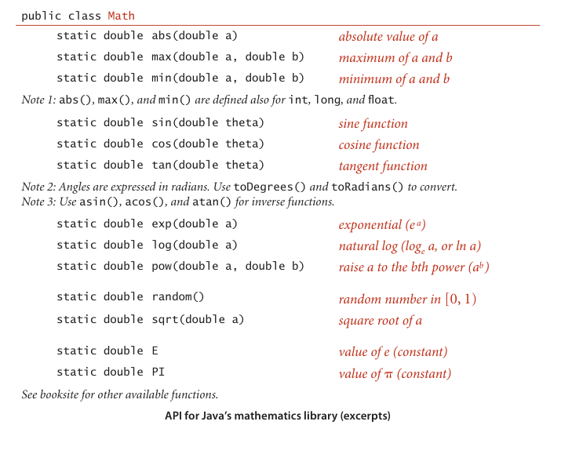

These methods implement mathematical functions—they use their arguments to compute a value of a specified type (except random(), which does not implement a mathematical function because it does not take an argument). Since they all operate on double values and compute a double result, you can consider them as extending the double data type—extensibility of this nature is one of the characteristic features of modern programming languages. Each method is described by a line in the API that specifies the information you need to know ***in order to*** use the method. The Math library also defines the precise constant values PI (for π) and E (for e), so that you can use those names to refer to those constants in your programs. For example, the value of Math.sin(Math.PI/2) is 1.0 and the value of Math.log(Math.E) is 1.0 (because Math.sin() takes its argument in `radians n. [数]弧度` and Math.log() implements the natural `logarithm n. [数] 对数` function). 

**Java libraries**. Extensive online descriptions of thousands of libraries are part of every Java release, but we `excerpt v. 摘录，节选` just a few methods that we use in the book, in order to clearly `delineate v. （详细地）描述，解释` our programming model. For example, BinarySearch uses the sort() method from Java’s Arrays library, which we document as follows:

```
public class Arrays
———————————————————
    static void sort(int[] a)       put the array in increasing order
Note : This method is defined also for other primitive types and Object.
                    ————Excerpt from Java’s Arrays library (java.util.Arrays)
```

The Arrays library is not in java.lang, so an import statement is needed to use it, as in BinarySearch. Actually, Chapter 2 of this book is devoted to implementations of sort() for arrays, including the mergesort and quicksort algorithms that are implemented in Arrays.sort(). Many of the fundamental algorithms that we consider in this book are implemented in Java and in many other programming environments. For example, Arrays also includes an implementation of binary search. To avoid `confusion n. 困惑，不明确；混淆`, we generally use our own implementations, although there is nothing wrong with using a finely `tuned adj. 经调谐的；谱好曲的` library implementation of an algorithm that you understand.

Our standard libraries. We have developed a number of libraries that provide useful functionality for `introductory adj. 引导的，介绍的；入门的，初步的` Java programming, for scientific applications, and for the development, study, and application of algorithms. Most of these libraries are for input and output; we also make use of the following two libraries to test and analyze our implementations. The first extends Math.random() to allow us to ***draw*** random values ***from*** various distributions; the second supports statistical calculations:

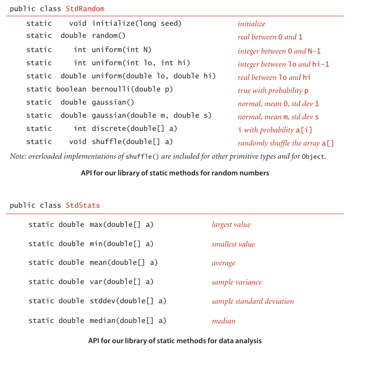

The initialize() method in StdRandom allows us to seed the random number generator so that we can reproduce `experiments n. 实验，试验` involving random numbers. For reference, implementations of many of these methods are given on page 32. Some of these methods are extremely easy to implement; why do we bother including them in a library? Answers to this question are standard for well-designed libraries: 

- They implement a level of abstraction that allow us to focus on implementing and testing the algorithms in the book, not generating random objects or calculating statistics. Client code that uses such methods is clearer and easier to understand than `homegrown adj. 国产的；自家种植的` code that does the same calculation. 

- Library implementations test for exceptional conditions, cover rarely encountered situations, and submit to extensive testing, so that we can count on them to operate as expected. Such implementations might involve a significant amount of code. For example, we often want implementations for various types of data. For example, Java’s Arrays library includes multiple overloaded implementations of sort(), one for each type of data that you might need to sort. 

These are `bedrock n. [地质] 基岩；根底；基本原理` considerations for modular programming in Java, but perhaps a bit overstated in this case. While the methods in both of these libraries are essentially self-documenting and many of them are not difficult to implement, some of them represent interesting algorithmic exercises. Accordingly, you are well-advised to both study the code in StdRandom.java and StdStats.java on the booksite and to take advantage of these tried-and-true implementations. The easiest way to use these libraries (and to examine the code) is to download the source code from the booksite and put them in your working directory; various system-dependent mechanisms for using them without making multiple copies are also described on the booksite. 

**Your own libraries**. It is worthwhile to consider every program that you write as a library implementation, for possible reuse in the future. 

- Write code for the client, a top-level implementation that breaks the computation up into manageable parts. 

- `Articulate v. 明确表达，清楚说明；口齿清楚地说` an API for a library (or multiple APIs for multiple libraries) of static methods that can address each part. 

- Develop an implementation of the API, with a main() that tests the methods independent of the client. 

***Not only*** does this approach provide you with valuable software that you can later reuse, ***but*** also taking advantage of modular programming in this way is a key to successfully addressing a complex programming task.

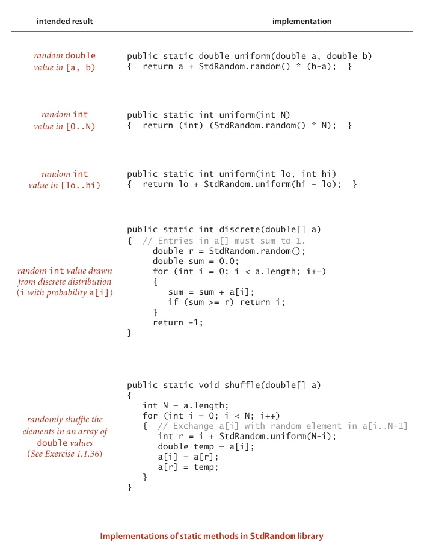

The purpose of an API is to ***separate*** the client ***from*** the implementation: the client should know nothing about the implementation other than information given in the API, and the implementation should not take properties of any particular client into account. APIs enable us to separately develop code for various purposes, then reuse it widely. No Java library can contain all the methods that we might need for a given computation, so this ability is a `crucial adj. 至关重要的，决定性的` step in addressing complex programming applications. Accordingly, programmers normally think of the API as a contract between the client and the implementation that is a clear specification of what each method is to do. Our goal when developing an implementation is to honor the terms of the contract. Often, there are many ways to do so, and separating client code from implementation code gives us the freedom to substitute new and improved implementations. In the study of algorithms, this ability is an important ingredient in our ability to understand the impact of algorithmic improvements that we develop.

**Strings** A String is a sequence of characters (char values). A literal String is a sequence of characters within `double quotes 双引号`, such as "Hello, World". The data type String is a Java data type but it is not a primitive type. We consider String now because it is a fundamental data type that almost every Java program uses. 

**Concatenation 字符串拼接**. Java has a `built-in 内置` concatenation operator (+) for String like the built-in operators that it has for primitive types, justifying the addition of the row in the table below to the primitive-type table on page 12. The result of concatenating two String values is a single String value, the first string followed by the second.

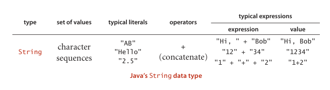

**Conversion**. Two primary uses of strings are to convert values that we can enter on a keyboard into data-type values and to convert data-type values to values that we can read on a display. Java has built-in operations for String to `facilitate v. 使更容易，使便利` these operations. In particular, the language includes libraries Integer and Double that contain static methods to convert between String values and int values and between String values and double values, ~~respectively 分别地~~.

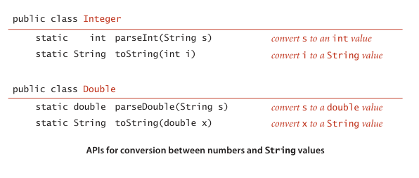

**Automatic conversion**. We rarely ~~explicitly~~ use the static toString() methods just described because Java has a built-in mechanism that allows us to convert from any data type value to a String value by using concatenation: if one of the arguments of + is a String, Java automatically converts the other argument to a String (if it is not already a String). Beyond usage like "The square root of 2.0 is " + Math.sqrt(2.0) this mechanism enables conversion of any data-type value to a String, by concatenating it with the empty string "". 

**Command-line arguments**. One important use of strings in Java programming is to enable a mechanism for passing information from the command line to the program. The mechanism is simple. When you type the java command followed by a library name followed by a sequence of strings, the Java system invokes the main() method in that library with an array of strings as argument: the strings typed after the library name. For example, the main() method in BinarySearch takes one command-line argument, so the system creates an array of size one. The program uses that value, args[0], to name the file containing the whitelist, for use as the argument to In.readInts(). Another typical `paradigm n. 典范，范例；样板，范式` that we often use in our code is when a command-line argument is intended to represent a number, so we use parseInt() to convert to an int value or parseDouble() to convert to a double value. 

Computing with strings is an essential component of modern computing. For the moment, we make use of String just to convert between external representation of numbers as sequences of characters and internal representation of numeric data-type values. In Section 1.2, we will see that Java supports many, many more operations on String values that we use throughout the book; in Section 1.4, we will `examine v. 检查，调查；考核，测验` the internal representation of String values; and in Chapter 5, we consider in depth algorithms that process String data. These algorithms are among the most interesting, intricate, and `impactful adj. 有效的；有力的` methods that we consider in this book.

### Input and output
比较不重要，略过

### Binary search
The sample Java program that we started with, shown on the facing page, is ***based on*** the famous, effective, and widely used binary search algorithm. This example is a `prototype n. （新型汽车、机器等的）原型，雏形；典型，范例；蓝本，最初形态` of the way in which we will examine new algorithms throughout the book. As with all of the programs we consider, it is both a precise definition of the method and a complete Java implementation that you can download from the booksite. 

**Binary search**. We will study the binary search algorithm in detail in Section 3.2, but a brief description is appropriate here. The algorithm is implemented in the static method rank(), which takes an integer key and a sorted array of int values as arguments and returns the index of the key if it is present in the array, -1 otherwise. It accomplishes this task by maintaining variables lo and hi such that the key is in a[lo..hi] if it is in the array, then entering into a loop that tests the middle entry in the interval (at index mid). If the key is equal to a[mid], the return value is mid; otherwise the method cuts the interval size about in half, looking at the left half if the key is less than a[mid] and at the right half if the key is greater than a[mid]. The process terminates when the key is found or the interval is empty. Binary search is effective because it needs to examine just a few array entries (relative to the size of the array) to find the key (or determine that it is not there).

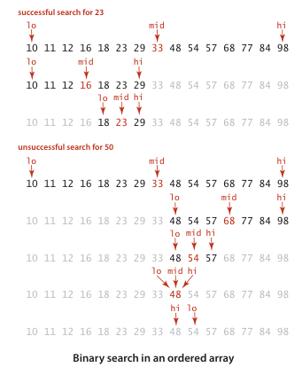

**Development client**. For every algorithm implementation, we include a development client main() that you can ***use*** with sample input files provided in the book and on the booksite ***to*** learn about the algorithm and ***to*** test its performance. In this example, the client reads integers from the file named on the command line, then prints any integers on standard input that do not appear in the file. We use small test files such as those shown at right to demonstrate this behavior, and as the basis for traces and examples such as those at left above. We use large test files to model real-world applications and to test performance (see page 48).

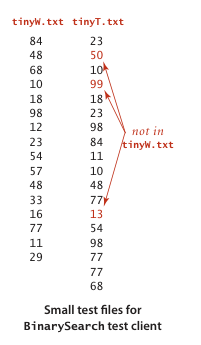

```java
import java.util.Arrays;
public class BinarySearch
{
    public static int rank(int key, int[] a)
    { // Array must be sorted.
        int lo = 0;
        int hi = a.length - 1;
        while (lo <= hi)
        { // Key is in a[lo..hi] or not present.
            int mid = lo + (hi - lo) / 2;
            if (key < a[mid]) hi = mid - 1;
            else if (key > a[mid]) lo = mid + 1;
            else return mid;
        }
        return -1;
    }
    public static void main(String[] args)
    {
        int[] whitelist = In.readInts(args[0]);
        Arrays.sort(whitelist);
        while (!StdIn.isEmpty())
        { // Read key, print if not in whitelist.
            int key = StdIn.readInt();
            if (rank(key, whitelist) < 0)
            StdOut.println(key);
        }
    }
}
```

This program takes the name of a whitelist file (a sequence of integers) as argument and filters any entry that is on the whitelist from standard input, leaving only integers that are not on the whitelist on standard output. It uses the binary search algorithm, implemented in the static method rank(), to accomplish the task efficiently. See Section 3.1 for a full discussion of the binary search algorithm, its `correctness n. 正确性`, its performance analysis, and its applications.
```
% java BinarySearch tinyW.txt < tinyT.txt
50
99
13
```

**Whitelisting**. When possible, our development clients ***are intended to*** mirror practical situations and demonstrate the `need for 需要` the algorithm at hand. In this case, the process is known as whitelisting. Specifically, imagine a credit card company that needs to check whether customer `transactions n. 交易，买卖` are for a valid account. To do so, it can 
- Keep customers account numbers in a file, which we refer to as a whitelist. 
- Produce the account number associated with each transaction in the standard input stream. 
- Use the test client to put onto standard output the numbers that are not associated with any customer. Presumably the company would refuse such transactions. 

It would not be unusual for a big company with millions of customers to have to process millions of transactions or more. To model this situation, we provide on the booksite the files largeW.txt (1 million integers) and largeT.txt (10 million integers). 

**Performance**. A working program is often not sufficient. For example, a much simpler implementation of rank(), which does not even require the array to be sorted, is to check every entry, as follows:
```java
public static int rank(int key, int[] a)
{
    for (int i = 0; i < a.length; i++)
        if (a[i] == key) return i;
    return -1;
}
```

Given this simple and easy-to-understand solution, why do we use mergesort and binary search? If you work Exercise 1.1.38, you will see that your computer is too slow to run this `brute-force adj. 依靠蛮力（获得）的` implementation of rank() for large numbers of inputs (say, 1 million whitelist entries and 10 million transactions). Solving the whitelist problem for a large number of inputs is not `feasible adj. 可行的，办得到的` without efficient algorithms such as binary search and mergesort. Good performance is often of critical importance, so we `lay the groundwork 奠定基础：为某事提供合适的条件或基础。` for studying performance in Section 1.4 and analyze the performance characteristics of all of our algorithms (including binary search, in Section 3.1 and mergesort, in Section 2.2). 

In the present context, our goal in thoroughly `outlining v. 概括` our programming model is to ensure that you can run code like BinarySearch on your computer, use it on test data like ours, and modify it to ***adapt to*** various situations (such as those described in the exercises at the end of this section), in order to best understand its `applicability n. 适用性；适应性`. The programming model that we have sketched is designed to facilitate such activities, which are crucial to our approach to studying algorithms.

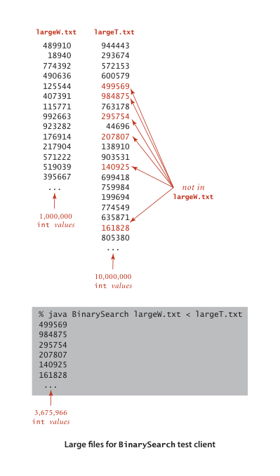

### Perspective 
In this section, we have described a fine and complete programming model that served (and still serves) many programmers for many decades. Modern programming, however, goes one step further. This next level is called data abstraction, sometimes known as object-oriented programming, and is the subject of the next section. Simply put, the idea behind data abstraction is to allow a program to define data types (sets of values and sets of operations on those values), not just static methods that operate on predefined data types. 

Object-oriented programming has come into widespread use in recent decades, and data abstraction is central to modern program development. We embrace data abstraction in this book for three primary reasons: 
- It enables us to expand our ability to reuse code through modular programming. For example, our sorts in Chapter 2 and binary search and other algorithms in Chapter 3 allow clients to make use of the same code for any type of data (not just integers), including one defined by the client. 
- It provides a convenient mechanism for building `so-called 所谓的` linked data structures that provide more flexibility than arrays and are the basis of efficient algorithms in many settings. 
- It enables us to precisely define the algorithmic challenges that we face. For example, our union-find algorithms in Section 1.5, our priority-queue algorithms in Section 2.4, and our symbol-table algorithms in Chapter 3 are all oriented toward defining data structures that enable efficient implementations of a set of operations. This challenge ***aligns*** perfectly ***with*** data abstraction. 

Despite all of these considerations, our focus remains on the study of algorithms. In this context, we proceed to consider next the essential features of object-oriented programming that are relevant to our `mission 使命，重要任务`.
