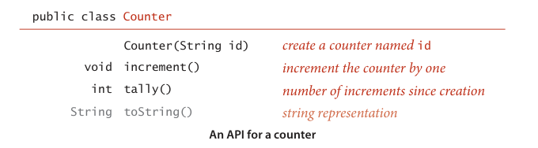
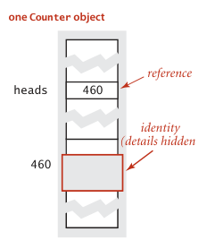
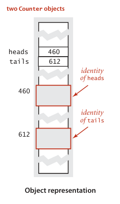
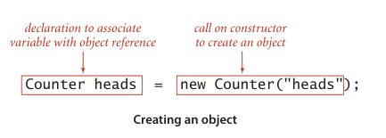

A data type is a set of values and a set of operations on those values. So far, we have discussed in detail Java’s primitive data types: for example, the values of the primitive data type int are integers between $-2^{31}$ and $2^{31}$ - 1; the operations of int include +, *, -, /, %, <, and >. In principle, we could write all of our programs using only the built-in primitive types, but it is much more convenient to write programs at a higher level of abstraction. In this section, we focus on the process of defining and using data types, which is known as data abstraction (and supplements the function abstraction style that is the basis of SECTION 1.1). 

Programming in Java is largely ***based on*** building data types ***known as*** reference types with the familiar Java class. This style of programming is known as object-oriented programming, as it revolves around the concept of an object, an entity that holds a data type value. With Java’s primitive types we are largely `confined v. 限制，使局限；关押，监禁` to programs that operate on numbers, but with reference types we can write programs that operate on strings, pictures, sounds, any of hundreds of other abstractions that are available in Java’s standard libraries or on our booksite. Even more significant than libraries of predefined data types is that the range of data types available in Java programming is `openended adj. 可扩充的；无终止的`, because you can define your own data types to implement any abstraction `whatsoever 任何，无论什么`. 

An abstract data type (ADT) is a data type whose representation is hidden from the client. Implementing an ADT as a Java class is not very different from implementing a function library as a set of static methods. The primary difference is that we ***associate*** data ***with*** the function implementations and we hide the representation of the data from the client. When using an ADT, we focus on the operations specified in the API and ***pay no attention to*** the data representation; when implementing an ADT, we focus on the data, then implement operations on that data. 

Abstract data types are important because they support encapsulation in program design. In this book, we use them as a means to 

- Precisely specify problems in the form of APIs for use by diverse clients 
- Describe algorithms and data structures as API implementations 

Our primary reason for studying different algorithms for the same task is that performance characteristics differ. Abstract data types are an appropriate framework for the study of algorithms because they allow us to put knowledge of algorithm performance to `immediate adj. 立刻的，即时的` use: we can substitute one algorithm for another to improve performance for all clients without changing any client code.

### Using abstract data types
You do not need to know how a data type is implemented ***in order to*** be able to use it, so we begin by describing how to write programs that use a simple data type named Counter whose values are a name and a `nonnegative adj. 非负的` integer and whose operations are create and initialize to zero, increment by one, and examine the current value. This abstraction is useful in many contexts. For example, it would be reasonable to use such a data type in electronic voting software, to ensure that the only thing that a voter can do is increment a chosen candidate’s `tally n. 记录，得分；账单` by one. Or, we might use a Counter to keep track of fundamental operations when analyzing the performance of algorithms. To use a Counter, you need to learn our mechanism for specifying the operations defined in the data type and the Java language mechanisms for creating and manipulating data-type values. Such mechanisms are critically important in modern programming, and we use them throughout this book, so this first example is worthy of careful attention. 

**API for an abstract data type**. To specify the behavior of an abstract data type, we use an application programming interface (API), which is a list of constructors and instance methods (operations), with an informal description of the effect of each, as in this API for Counter:



Even though the basis of a data-type definition is a set of values, the role of the values is not visible from the API, only the operations on those values. Accordingly, an ADT definition has many similarities with a library of static methods (see page 24): 

- Both are implemented as a Java class. 
- Instance methods may take zero or more arguments of a specified type, separated by commas and enclosed in parentheses. 
- They may provide a return value of a specified type or no return value (signified by void). 

And there are three significant differences: 

- Some entries in the API have the same name as the class and lack a return type. Such entries are known as constructors and play a special role. In this case, Counter has a constructor that takes a String argument.
- Instance methods lack the static modifier. They are not static methods—their purpose is to operate on data type values. 
- Some instance methods are present so as to ***adhere to*** Java conventions—we refer to such methods as inherited methods and shade them gray in the API. 

As with APIs for libraries of static methods, an API for an abstract data type is a contract with all clients and, therefore, the starting point both for developing any client code and for developing any data-type implementation. In this case, the API tells us that to use Counter, we have available the Counter() constructor, the increment() and tally() instance methods, and the inherited toString() method. 

**Inherited methods**. Various Java conventions enable a data type to take advantage of built-in language mechanisms by including specific methods in the API. For example, all Java data types `inherit v. 继承` a toString() method that returns a String representation of the data-type values. Java calls this method when any data-type value is to be concatenated with a String value with the + operator. The default implementation is not particularly useful (it gives a string representation of the memory address of the data-type value), so we often provide an implementation that overrides the default, and include toString() in the API whenever we do so. Other examples of such methods include equals(), compareTo(), and hashCode() (see page 101). 

**Client code**. As with modular programming based on static methods, the API allows us to write client code without knowing details of the implementation (and to write implementation code without knowing details of any particular client). The mechanisms introduced on page 28 for organizing programs as independent modules are useful for all Java classes, and thus are effective for modular programming with ADTs as well as for libraries of static methods. Accordingly, we can use an ADT in any program provided that the source code is in a .java file in the same directory, or in the standard Java library, or accessible through an import statement, or through one of the classpath mechanisms described on the booksite. All of the benefits of modular programming follow. By encapsulating all the code that implements a data type within a single Java class, we enable the development of client code at a higher level of abstraction. To develop client code, you need to be able to declare variables, create objects to hold data-type values, and provide access to the values for instance methods to operate on them. These processes are different from the corresponding processes for primitive types, though you will notice many similarities.

**Objects**. Naturally, you can declare that a variable heads is to be associated with data of type Counter with the code
```java
    Counter heads;
```
but how can you assign values or specify operations? The answer to this question involves a fundamental concept in data abstraction: an object is an entity that can take on a data-type value. Objects are characterized by three essential properties: state, identity, and behavior. The state of an object is a value from its data type. The identity of an object distinguishes one object from another. It is useful to think of an object’s identity as the place where its value is stored in memory. The behavior of an object is the effect of data-type operations. The implementation has the sole responsibility for maintaining an object’s identity, so that client code can use a data type without regard to the representation of its state by conforming to an API that describes an object’s behavior. An object’s state might be used to provide information to a client or cause a side effect or be changed by one of its data type’s operations, but the details of the representation of the data-type value are not relevant to client code. A reference is a mechanism for accessing an object. Java `nomenclature n. 命名法；术语` makes clear the distinction from primitive types (where variables are associated with values) by using the term reference types for nonprimitive types. The details of implementing references vary in Java implementations, but it is useful to think of a reference as a memory address, as shown at right (for brevity, we use three-digit memory addresses in the diagram).

 

**Creating objects**. Each data-type value is stored in an object. To create (or instantiate) an individual object, we invoke a constructor by using the keyword new, followed by the class name, followed by () (or a list of argument values enclosed in parentheses, if the constructor takes arguments). A constructor has no return type because it always returns a reference to an object of its data type. Each time that a client uses new(), the system

- Allocates memory space for the object
- Invokes the constructor to initialize its value
- Returns a reference to the object

In client code we typically create objects in an initializing declaration that associates a variable with the object, as we often do with variables of primitive types. Unlike primitive types, variables are associated with references to objects, not the data-type values themselves. We can create any number of objects from the same class— each object has its own identity and may or may not store the same value as another object of the same type. For example, the code



```java
    Counter heads = new Counter("heads");
    Counter tails = new Counter("tails");
```
